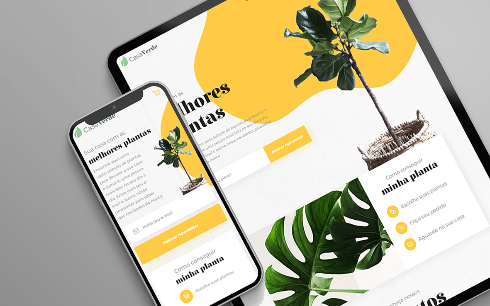
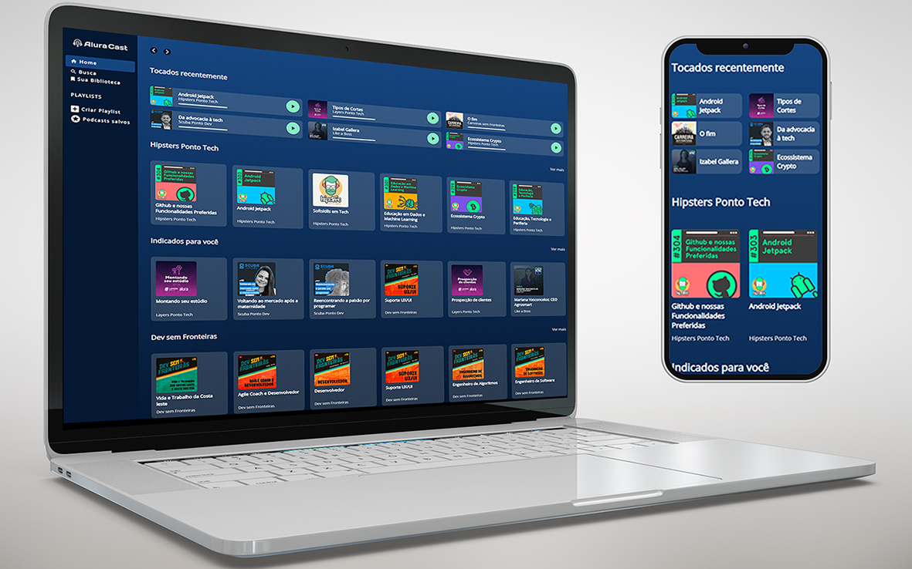
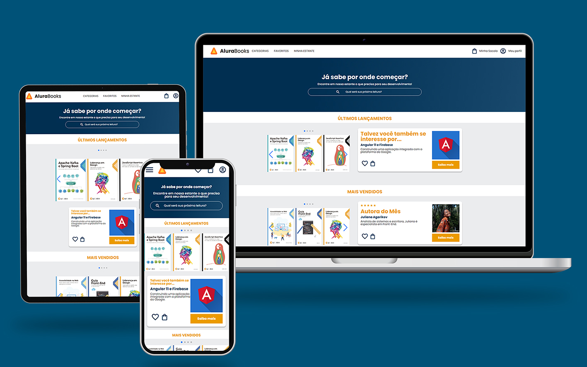
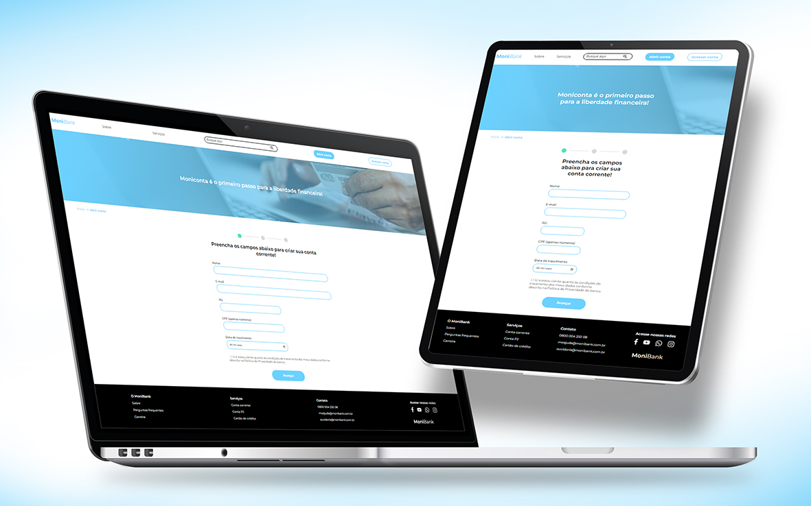

[Não fala Inglês? Clique aqui para acessar a versão em Português.](https://github.com/Rodolfo-Sampaio)
# Hey, how's it going? 

My name is <i>🏄Rodolfo Sampaio</i>, a Full Stack development enthusiast. I constantly seek inspiring challenges to enhance my technical skills, staying updated with the latest trends and practices.

 

### 👽 About me:

Over 20 years ago, I began my journey immersed in the world of graphic arts, progressing later to 3D modeling, covering a variety of projects in both industrial and artistic domains. I have also worked as an operator for CNC machining centers and 3D printers, contributing to the jewelry, advertising, and dental prosthesis sectors.

- 📍	Born in Osvaldo Cruz-SP.
- 👨‍🎓 Graduated in Public Management Technology from Anhanguera University - Uniderp.
- 🖥️ I am currently taking the front-end and programming courses at [`Alura`](https://www.alura.com.br/) - [`My certificates`](https://cursos.alura.com.br/user/rodsenatore0/fullCertificate/4df6adbdf9b8ebc5cd047e36e3264182)📄.

- 🎯 Objective: Full Stack Developer.  

 
 

<table align="center">
  <tr>
    <th>
      <h3>Technologies and Tools</h3>
    </th>
    <th>
      
    </th>
  </tr>
  <tr>
    <td>
      
      
      
      
      
      
      
       
      
      
      
      
    </td>
    <td>Front-end</td>
  </tr>
  <tr>
    <td>
      
      
      
      
    </td>
    <td>Back-end</td>
  </tr>
  <tr>
    <td>
      
      
    </td>
    <td>Database</td>
  </tr>
  <tr>
    <td>
      
      
      
      
    </td>
    <td>Version Control</td>
  </tr>
  <tr>
    <td>
      
      
      
      
      
      
    </td>
    <td>Design</td>
  </tr>
  <tr>
    <td>
      
      
      
      
      
    </td>
    <td>3D Modeling</td>
  </tr>
  <tr>
    <td>
      
      
      
      
      
      
    </td>
    <td>Applications</td>
  </tr>
</table>

<h5 align="center">"Constant evolution, there is always something new to learn." </h5>
 

  </a>
  <h3>🔍 How to reach me</h3>
   
  
    

 
 

<h3>👀 Some of my repositories 👇</h3>

<table>
  <tr>
    <td valign="top" width="50%">
      <h2 align="center"><a href="https://github.com/Rodolfo-Sampaio/vidflow">VidFlow</a></h2>
      
       
       
      
 Technologies used in this project ⚡ 

      
        
        
        
        
      
       
       
      
With promise methods to consume an API and fetch videos for the application, we improved the code by incorporating async/await for better asynchronous management and handling errors more efficiently....

    </td>
    <td valign="top" width="50%">
      <h2 align="center"><a href="https://github.com/Rodolfo-Sampaio/Casa-Verde">Casa Verde</a></h2>
      
       
       
      
 Technologies used in this project ⚡ 

        
        
        
        
        
          
      
      
Development of components following a style guide, promoting visual consistency, and facilitating code maintenance....

    </td>
  </tr>
  <tr>
    <td valign="top" width="50%">
      <h2 align="center"><a href="https://github.com/Rodolfo-Sampaio/monibank">Alura Cast</a></h2>
      
       
       
      
 Technologies used in this project ⚡ 

      
        
        
      
       
       
      
Built with HTML and CSS, emphasizing extensive use of the Display Grid. The innovative and responsive layout of elements enables intuitive navigation...

    </td>
    <td valign="top" width="50%">
      <h2 align="center"><a href="https://github.com/Rodolfo-Sampaio/Alura-Books">Alura Books</a></h2>
      
       
       
      
 Technologies used in this project ⚡ 

        
        
        
        
          
      
      
BEM methodology following the 'Mobile First' approach. Interactive dropdown menu without JavaScript, styled with ':hover' and ':checked'. 'SwiperJs' was used for modern slides...

    </td>
  </tr>
  <tr>
    <td valign="top" width="50%">
      <h2 align="center"><a href="https://github.com/Rodolfo-Sampaio/monibank">Monibank</a></h2>
      
       
       
      
 Technologies used in this project ⚡ 

      
        
        
        
      
       
       
      
Implementation of validations in the registration form fields using HTML5 attributes. JavaScript comes into play to detect interactions, check CPF, and validate age...

    </td>
  </tr>
</table>

### All of my repositories 

 

<h2>GitHub Statistics</h2>

   
   
  

