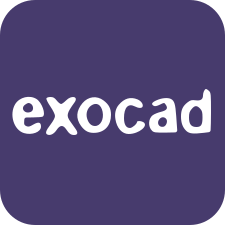
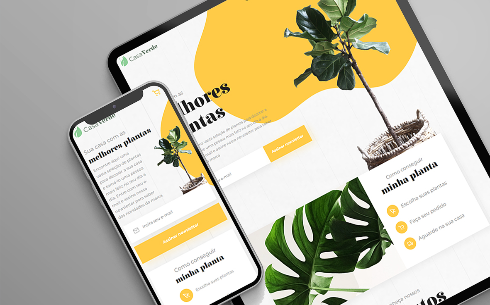
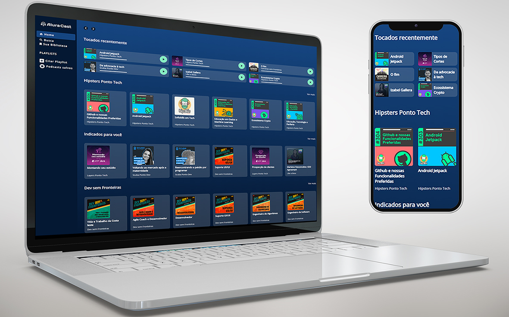
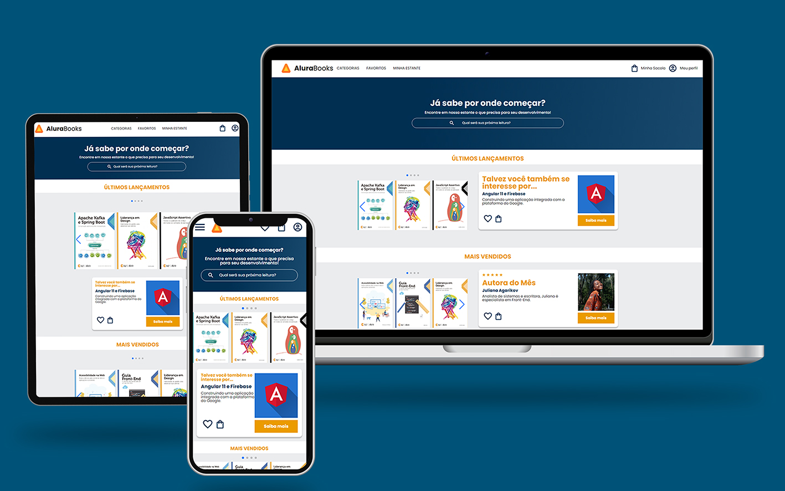
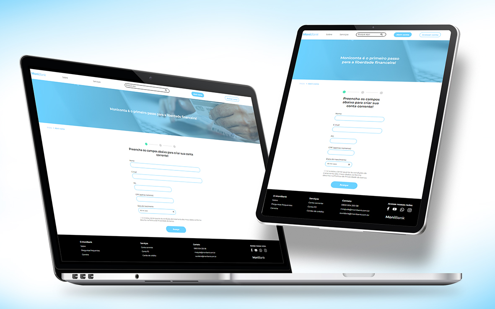

[You're not a Portuguese speaker? Click here to access the English version.](https://github.com/Rodolfo-Sampaio/Rodolfo-Sampaio/blob/main/README-EN.md)

# E aí, tudo bem? 

Me chamo <i>🏄Rodolfo Sampaio</i>, entusiasta do desenvolvimento Full Stack. Busco constantemente desafios inspiradores para aprimorar minhas habilidades técnicas, mantendo-me atualizado com as últimas tendências e práticas.

 
 

### 👽 Sobre mim:

Há mais de 20 anos, iniciei minha trajetória imerso no universo das artes gráficas, progredindo em seguida para a modelagem 3D abrangendo uma variedade de projetos tanto industriais quanto artísticos. Atuei também como operador de centros de usinagem CNC e impressoras 3D contribuindo para os setores de joias, publicitário e prótese dentária.

- 📍 Natural de Osvaldo Cruz-SP.
- 👨‍🎓 Graduado em Tecnologia em Gestão Pública pela Universidade Anhanguera - Uniderp
- 🖥️ Estou cursando as formações front-end e programação da [`Alura`](https://www.alura.com.br/) - [`Meus certificados`](https://cursos.alura.com.br/user/rodsenatore0/fullCertificate/4df6adbdf9b8ebc5cd047e36e3264182)📄.

- 🎯 Objetivo: Desenvolvedor Full Stack.

 
 

<table align="center">
  <tr>
    <th>
      <h3>Tecnologias e Ferramentas</h3>
    </th>
    <th>
      
    </th>
  </tr>
  <tr>
    <td>
      
      
      
      
      
      
      
       
      
      
      
      
    </td>
    <td>Front-end</td>
  </tr>
  <tr>
    <td>
      
      
      
      
    </td>
    <td>Back-end</td>
  </tr>
  <tr>
    <td>
      
      
    </td>
    <td>Banco de Dados</td>
  </tr>
  <tr>
    <td>
      
      
            
      
    </td>
    <td>Versionamento</td>
  </tr>
  <tr>
    <td>
      
      
      
      
      
      
    </td>
    <td>Design</td>
  </tr>
  <tr>
    <td>
      
      
      
      
      
    </td>
    <td>Modelagem 3D</td>
  </tr>
  <tr>
    <td>
      
      
      
      
      
      
    </td>
    <td>Aplicativos</td>
  </tr>
</table>

<h5 align="center">"Evolução constante, sempre há algo novo para aprender."</h5>

 

  </a>
  <h3>🔍 Me encontre</h3>
   
  

 
 

<h3>👀 Alguns dos meus repositórios 👇</h3>

<table>
  <tr>
    <td valign="top" width="50%">
      <h2 align="center"><a href="https://github.com/Rodolfo-Sampaio/vidflow">VidFlow</a></h2>
      
       
       
      
 Tecnologias utilizadas nesse projeto ⚡ 

      
        
        
        
        
      
       
       
      
Com métodos promises para consumir uma API e obter os vídeos para a aplicação. Aprimoramos o código ao incorporar o async/await para melhor gerenciamento assíncrono e efetuar a captura de erros de maneira mais eficiente....

    </td>
    <td valign="top" width="50%">
      <h2 align="center"><a href="https://github.com/Rodolfo-Sampaio/Casa-Verde">Casa Verde</a></h2>
      
       
       
      
 Tecnologias utilizadas nesse projeto ⚡ 

        
        
        
        
        
          
      
      
Desenvolvimento de componentes seguindo um guia de estilos, promovendo consistência visual e facilitando a manutenção do código...

    </td>
  </tr>
  <tr>
    <td valign="top" width="50%">
      <h2 align="center"><a href="https://github.com/Rodolfo-Sampaio/monibank">Alura Cast</a></h2>
      
       
       
      
 Tecnologias utilizadas nesse projeto ⚡ 

      
        
        
      
       
       
      
Construída com HTML e CSS, destacando o uso extensivo do Display Grid. A disposição inovadora e responsiva dos elementos permite uma navegação intuitiva...

    </td>
    <td valign="top" width="50%">
      <h2 align="center"><a href="https://github.com/Rodolfo-Sampaio/Alura-Books">Alura Books</a></h2>
      
       
       
      
 Tecnologias utilizadas nesse projeto ⚡ 

        
        
        
        
          
      
      
Metodologia "BEM", seguindo a abordagem "Mobile First". Com menu suspenso interativo sem JavaScript, estilizado com ":hover" e ":checked". Foi utilizado o "SwiperJs" para slides modernos...

    </td>
  </tr>
  <tr>
    <td valign="top" width="50%">
      <h2 align="center"><a href="https://github.com/Rodolfo-Sampaio/monibank">Monibank</a></h2>
      
       
       
      
 Tecnologias utilizadas nesse projeto ⚡ 

      
        
        
        
      
       
       
      
Implementação de validações nos campos do formulário de cadastro, utilizando atributos do HTML5. O JavaScript entra em ação para detectar interações, verificação de CPF, validação de maioridade...

    </td>
  </tr>
</table>

### Todos os meus repositórios 

 

<h2>Estatísticas do GitHub</h2>

   
   
  

